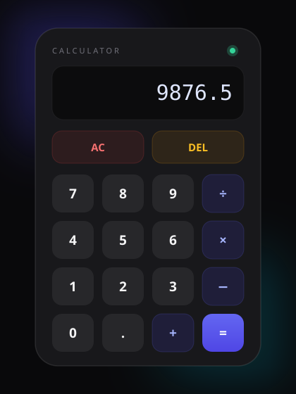

# Calculator

<p align="center">
  
</p>

A modern, glassmorphism-styled calculator built with **Next.js**, **React**, and **Tailwind CSS**. Features a safe custom expression parser (no `eval`), an auto-sizing display, full keyboard support, and a sleek dark theme with ambient glows.

[](https://github.com/OWNER/REPO/actions/workflows/ci.yml)

## Features

- ➕ Basic arithmetic: addition, subtraction, multiplication, division
- 🔢 Decimal support with unary minus (negative numbers)
- 🛡️ Safe expression evaluation — custom recursive-descent parser instead of `eval()`
- 🧠 Graceful edge-case handling: trailing operators (`5+` → `5`), divide-by-zero errors, invalid input recovery
- 📱 Responsive auto-sizing display that shrinks for long expressions
- ⌨️ **Full keyboard support**: type digits, operators (`+ - * /`), and `.`; press **Enter**/**`=`** to evaluate, **Backspace** to delete, **Escape** to clear
- ✨ Clean glassmorphism UI with hover/press animations
- ⚡ React Compiler enabled for optimized re-renders
- 🔄 CI via GitHub Actions (Biome lint, TypeScript check, production build on every push/PR)

## Tech Stack

| Layer | Technology |
| --- | --- |
| Framework | Next.js 16 (App Router) |
| UI Library | React 19 |
| Language | TypeScript 5 |
| Styling | Tailwind CSS 4 |
| Fonts | Geist Sans & Geist Mono (via `next/font`) |
| Linter/Formatter | Biome 2 |
| Package Manager | Bun (with `bun.lock`) |

## Dependencies Explained

### Production dependencies

| Package | Version | What it does |
| --- | --- | --- |
| `next` | 16.2.9 | The React framework powering the app — handles routing (App Router), server/client rendering, bundling, font optimization, and the dev server. |
| `react` | 19.2.4 | Core UI library. The calculator's interactive state (display expression, button clicks) is managed with React hooks (`useState`). |
| `react-dom` | 19.2.4 | React's renderer for the web — mounts React components into the browser DOM. |

### Development dependencies

| Package | Version | What it does |
| --- | --- | --- |
| `typescript` | ^5 | Adds static typing to JavaScript. Runs via `tsc --noEmit` to catch type errors before they reach the browser. |
| `tailwindcss` | ^4 | Utility-first CSS framework. All styling in the calculator (gradients, glass effects, grids) is done with Tailwind classes. |
| `@tailwindcss/postcss` | ^4 | PostCSS plugin that lets Next.js process Tailwind v4 styles — wired up in `postcss.config.mjs`. |
| `@biomejs/biome` | 2.2.0 | All-in-one linter + formatter (replaces ESLint/Prettier). Enforces code quality and consistent formatting via `npm run lint` / `npm run format`. |
| `@types/node` | ^20 | TypeScript type definitions for Node.js APIs. |
| `@types/react` | ^19 | TypeScript type definitions for React (hooks, JSX, events). |
| `@types/react-dom` | ^19 | TypeScript type definitions for React DOM. |
| `babel-plugin-react-compiler` | 1.0.0 | React Compiler integration — automatically memoizes components and values to avoid unnecessary re-renders. Enabled via `reactCompiler: true` in `next.config.ts`. |

### Global packages you need installed (machine setup)

- **Node.js 20+** — JavaScript runtime (required by npm/Next.js)
- **npm** — comes bundled with Node.js
- **Bun** *(optional but recommended)* — faster package manager; the repo ships a `bun.lock`

## Prerequisites — Machine Setup

Before running the project, set up your machine:

### 1. Install Node.js (v20 or later)

**Windows** — download the installer from [nodejs.org](https://nodejs.org) or use winget:

```powershell
winget install OpenJS.NodeJS.LTS
```

**macOS** — using Homebrew:

```bash
brew install node
```

**Linux (Debian/Ubuntu)**:

```bash
curl -fsSL https://deb.nodesource.com/setup_20.x | sudo -E bash -
sudo apt-get install -y nodejs
```

Verify the install:

```bash
node --version   # should print v20.x.x or later
npm --version
```

### 2. Install Bun (optional — recommended)

```bash
# macOS / Linux
curl -fsSL https://bun.sh/install | bash

# Windows (PowerShell)
powershell -c "irm bun.sh/install.ps1 | iex"
```

Verify:

```bash
bun --version
```

> If you skip Bun, you can use `npm` for everything instead (see commands below).

## Getting Started

### 1. Clone and enter the project

```bash
git clone <your-repo-url>
cd Calculator
```

### 2. Install dependencies

**With Bun (recommended — matches `bun.lock`):**

```bash
bun install
```

**With npm:**

```bash
npm install
```

### 3. Run the development server

```bash
bun run dev
# or
npm run dev
```

Open [http://localhost:3000](http://localhost:3000) in your browser. The page hot-reloads as you edit files.

### 4. Build for production (optional)

```bash
bun run build
bun run start
# or with npm
npm run build
npm run start
```

## Available Scripts

| Script | Command | Description |
| --- | --- | --- |
| `dev` | `bun run dev` / `npm run dev` | Starts the dev server with hot reload at `localhost:3000`. |
| `build` | `bun run build` / `npm run build` | Creates an optimized production build in `.next/`. |
| `start` | `bun run start` / `npm run start` | Serves the production build (run `build` first). |
| `lint` | `bun run lint` / `npm run lint` | Runs Biome to lint and check formatting. |
| `format` | `bun run format` / `npm run format` | Auto-formats the codebase with Biome. |

## Project Structure

```
Calculator/
├── src/
│   ├── Calculator/
│   │   └── Calculator.tsx    # The calculator component (UI + logic)
│   └── app/
│       ├── layout.tsx        # Root layout (fonts, metadata)
│       ├── page.tsx          # Home page — renders <Calculator />
│       ├── globals.css       # Tailwind + theme variables
│       └── favicon.ico
├── public/                   # Static assets
├── next.config.ts            # Next.js config (React Compiler enabled)
├── postcss.config.mjs        # PostCSS config (Tailwind plugin)
├── biome.json                # Biome linter/formatter config
├── tsconfig.json             # TypeScript config (@/* → ./src/* path alias)
├── package.json              # Scripts + dependencies
└── .github/
    └── workflows/
        └── ci.yml            # GitHub Actions CI (lint + typecheck + build)
```

## Continuous Integration

The repo ships with a GitHub Actions workflow (`.github/workflows/ci.yml`) that runs on every push and pull request to `main`:

1. **Install** — `bun install --frozen-lockfile` (via `oven-sh/setup-bun`)
2. **Lint** — Biome check across the project
3. **Typecheck** — `tsc --noEmit`
4. **Build** — full production build to catch build-time errors

> The badge at the top assumes your repo lives at `github.com/OWNER/REPO` — update it after pushing.

## How It Works

The entire app lives in [`src/Calculator/Calculator.tsx`](src/Calculator/Calculator.tsx):

1. **State** — a single `useState` hook holds the current display expression (starts at `"0"`).
2. **Input** — `handleClick` appends digits/operators; `clear` (AC) resets; `deleteLast` (DEL) backspaces.
3. **Evaluation** — when `=` is pressed, `evaluateExpression` tokenizes the string and parses it with a recursive-descent parser:
   - `parsePrimary` handles numbers and unary `+`/`-`
   - `parseTerm` handles `*` and `/` (higher precedence)
   - the main loop handles `+` and `-` (lower precedence)
4. **Safety** — no `eval()`. Malformed input throws and displays `"Error"`; trailing operators are trimmed before evaluation (`5+` → `5`).
5. **Display** — font size auto-adjusts based on expression length (`text-4xl` → `text-3xl` → `text-2xl`).
6. **Keyboard** — a `useEffect` registers a global `keydown` listener: digits/`.`/operators route to `handleClick`, **Enter**/**`=`** to `calculate`, **Backspace** to `deleteLast`, and **Escape** to `clear`.

## Troubleshooting

| Problem | Fix |
| --- | --- |
| `bun: command not found` | Use `npm` commands instead, or install Bun (see Prerequisites). |
| Port 3000 already in use | Run `npm run dev -- -p 3001` to use a different port. |
| Type errors about missing modules | Delete `node_modules` and reinstall: `rm -rf node_modules && npm install`. |
| Biome not found when linting | Ensure dev dependencies are installed (`npm install`), then re-run `npm run lint`. |
| Sharp install warnings | Safe to ignore — Next.js uses sharp optionally for image optimization. |

## Deploy on Vercel

The easiest way to deploy is with the [Vercel Platform](https://vercel.com/new) from the creators of Next.js:

1. Push the repo to GitHub/GitLab/Bitbucket
2. Import the project at [vercel.com/new](https://vercel.com/new)
3. Vercel auto-detects Next.js — just click **Deploy**

See the [Next.js deployment docs](https://nextjs.org/docs/app/building-your-application/deploying) for details.

---

Learn more about the underlying tools: [Next.js docs](https://nextjs.org/docs) · [React docs](https://react.dev) · [Tailwind CSS docs](https://tailwindcss.com/docs) · [Biome docs](https://biomejs.dev)
